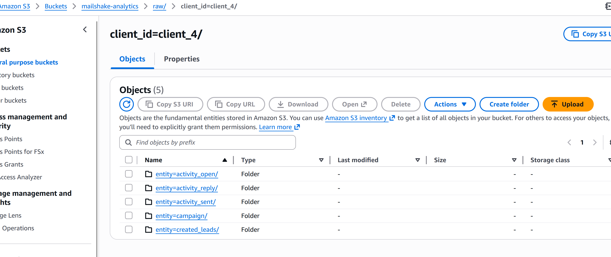
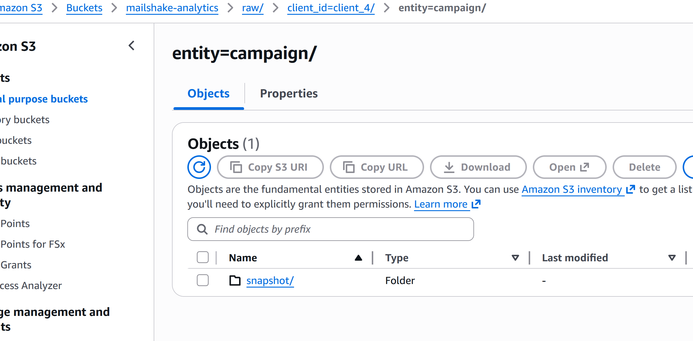
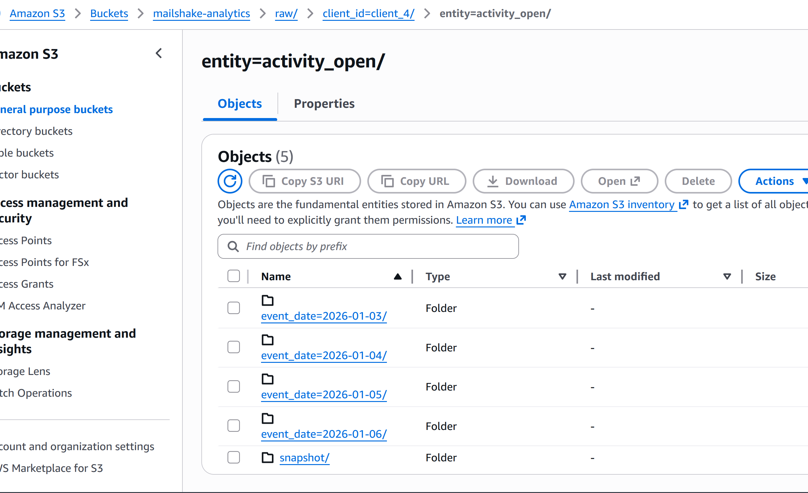
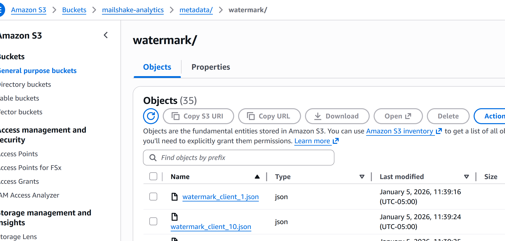
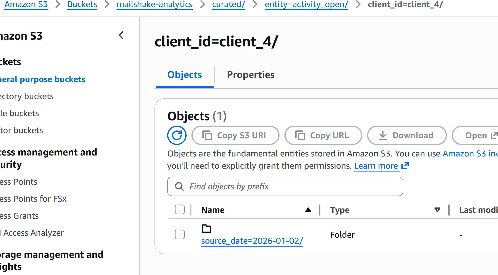
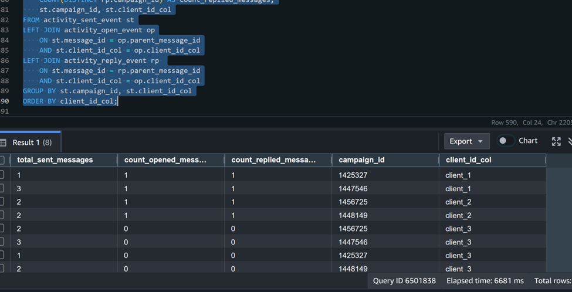

# PySpark Sandbox Cluster

A minimal sandbox cluster running via `docker-compose` (1 master, 1 worker) as described in [this medium article](https://medium.com/p/9f12e915ecf4/edit).

TLDR: I'm not reading that article

1. `export JAVA_HOME=/path/to/jre` 
2. `docker pull bitnami/spark:3.5.1`
3. `conda create -n pyspark-311 python=3.11 pyspark=3.5.1`
4. `export HOST_IP=<YOUR IPV4 IP>`
5. `docker-compose up --build`
6. `conda activate pyspark-311 && python hello-pyspark.py`

Run the below docker command to spin up jupyter notebook to run the pyspark scripts/notebook.
`

docker run -d --name spark-jupyter ^
  -p 8888:8888 ^
  -p 4040:4040 ^
  -v %cd%:/opt/spark/work-dir ^
  -e AWS_ACCESS_KEY_ID=<AWS_ACCESS_KEY_ID> ^
  -e AWS_SECRET_ACCESS_KEY=<AWS_SECRET_ACCESS_KEY> ^
  spark-jupyter
`

A jupyter notebook will open on successful execution of the above command.

Execute the `DataIngestion.ipynb` script and ingest the data from Mailshake API for the different clients. The data is stored in the below format i.e. snapshot and event-date. 

Snapshot data is stored below 

Incremental data is stored in the event folders. 

The incremental processing happens with the help of watermark stored 

The data is raw format will be processed by the  `Data transformation script` and saved in curated format

Metrics:

Per client count of sent, opened and replied messages.

`SELECT
    COUNT(DISTINCT st.message_id) as total_sent_messages,
    COUNT(DISTINCT op.parent_message_id) AS count_opened_messages,
    COUNT(DISTINCT rp.parent_message_id) AS count_replied_messages,
    st.client_id_col
FROM activity_sent_event st
LEFT JOIN activity_open_event op
    ON st.message_id = op.parent_message_id
AND st.client_id_col = op.client_id_col
LEFT JOIN activity_reply_event rp 
   ON st.message_id = rp.parent_message_id
AND st.client_id_col = rp.client_id_col
GROUP BY st.client_id_col
`

Per campaign count of sent , opened and replied messages

`SELECT
    COUNT(DISTINCT st.message_id) as total_sent_messages,
    COUNT(DISTINCT op.campaign_id) AS count_opened_messages,
    COUNT(DISTINCT rp.campaign_id) AS count_replied_messages,
    st.campaign_id, st.client_id_col
FROM activity_sent_event st
LEFT JOIN activity_open_event op
    ON st.message_id = op.parent_message_id
    AND st.client_id_col = op.client_id_col
LEFT JOIN activity_reply_event rp 
    ON st.message_id = rp.parent_message_id
    AND st.client_id_col = op.client_id_col
GROUP BY st.campaign_id, st.client_id_col
ORDER BY client_id_col;
`
