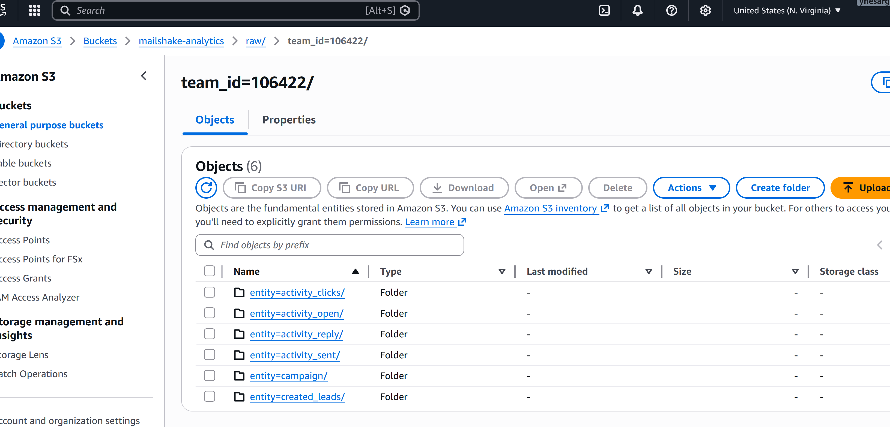
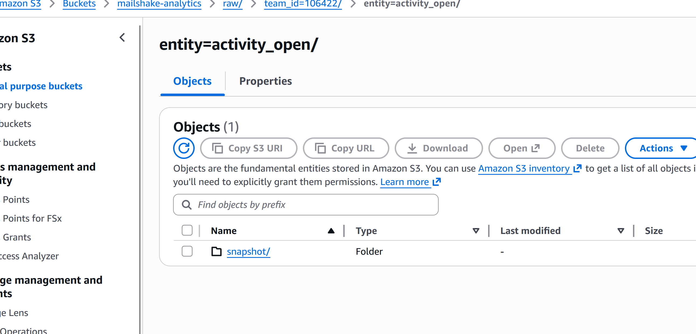
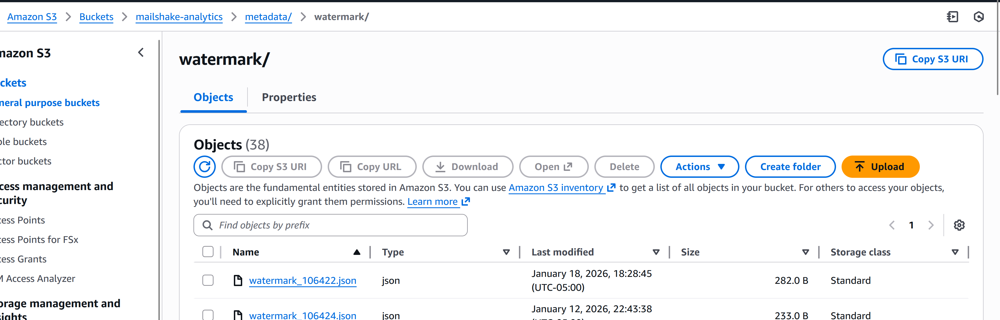
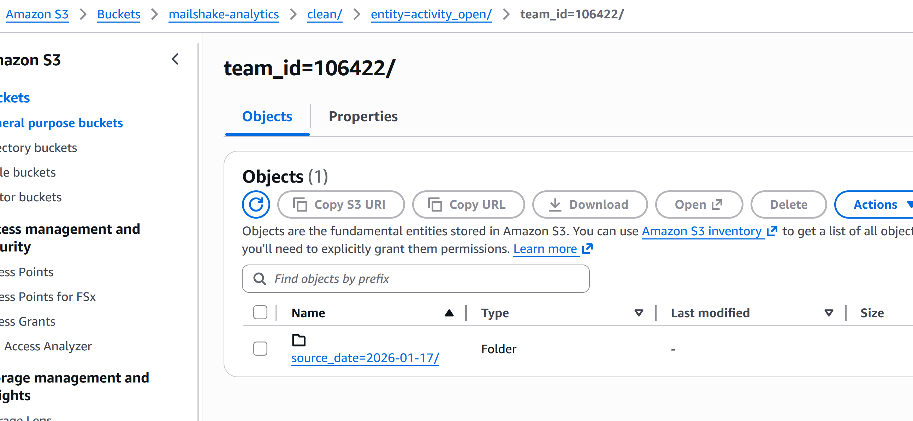
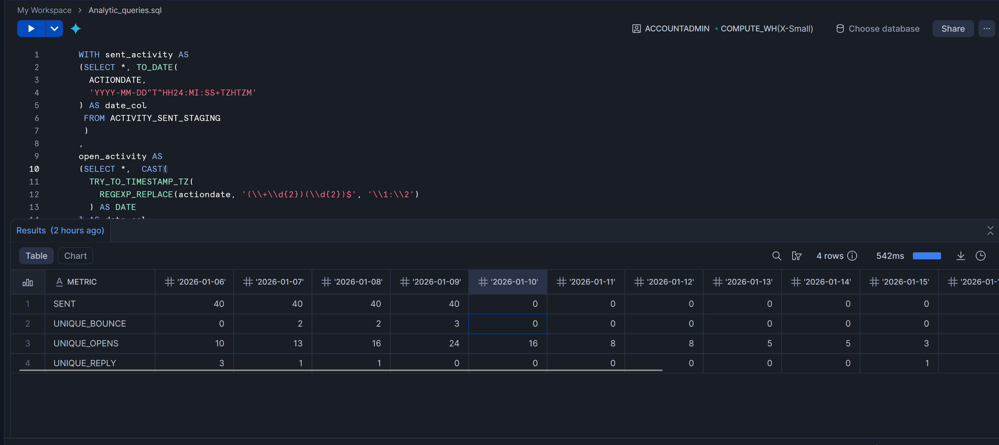
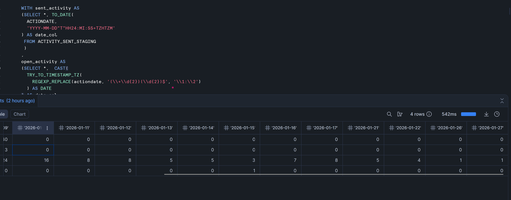

# PySpark Sandbox Cluster

A minimal sandbox cluster running via `docker-compose` (1 master, 1 worker) as described in [this medium article](https://medium.com/p/9f12e915ecf4/edit).

TLDR: I'm not reading that article

1. `export JAVA_HOME=/path/to/jre` 
2. `docker pull bitnami/spark:3.5.1`
3. `conda create -n pyspark-311 python=3.11 pyspark=3.5.1`
4. `export HOST_IP=<YOUR IPV4 IP>`
5. `docker-compose up --build`
6. `conda activate pyspark-311 && python hello-pyspark.py`

Run the below docker command to spin up jupyter notebook to run the pyspark scripts/notebook.

`docker run -d --name spark-jupyter ^
  -p 8888:8888 ^
  -p 4040:4040 ^
  -v %cd%:/opt/spark/work-dir ^
  -e AWS_ACCESS_KEY_ID=<AWS_ACCESS_KEY_ID> ^
  -e AWS_SECRET_ACCESS_KEY=<AWS_SECRET_ACCESS_KEY> ^
  spark-jupyter`

A jupyter notebook will open on successful execution of the above command.

Run the 'job_ingest' script to ingest data from the Mailshake API for the various clients. The data is stored in the following formats: snapshot and event-date partitions. 

Snapshot data is stored below 

Incremental data is stored in the event folders. 

The incremental processing happens with the help of watermark stored 

The data is currently in raw format and will be processed by the 'job_transform' job , then saved in a clean, structured format.

Metrics:

Per client per date count of sent, opened and replied/bounced messages. 

Path to sql script: warehouse_scripts\snowflake_analytical_queries

